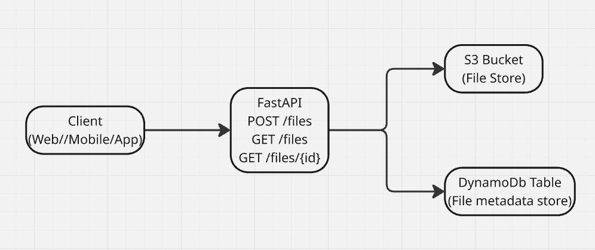
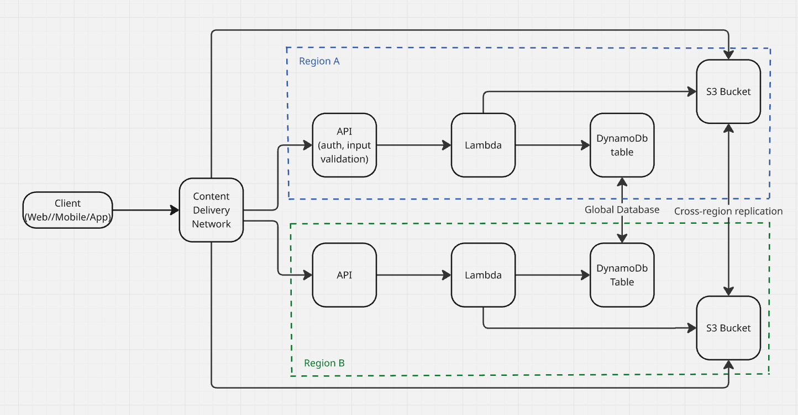

# File Share Service (FastAPI + S3 + DynamoDB + LocalStack)

A lightweight file-sharing API built with FastAPI.
S3 (LocalStack) -> stores files
DynamoDB (LocalStack) -> stores metadata
FastAPI -> provides REST endpoints for upload, download, and listing

The repo contains source code for running and testing the app locally.
At the end of this document are Assumptions, design decisions, enterprise-grade scale and future extensions.

## Features
- `POST /files` -> Upload a file (max 20MB)
- `GET /files/{id}` -> Download file by ID
- `GET /files` -> List all uploaded files (metadata only)
- File metadata includes: id, filename, size, contentType, uploadedAt, sha256
- Runs locally with `LocalStack` (no AWS account needed)
- `Makefile` for ease of testing and running locally

# Assumptions & Design Decisions
I've made few assumptions factoring the development effort, cost and operational considerations but keeping the design open for future evolution.

- Personas: Professor and students
  - Geolocated in same region.
  - Small number of clients accessing the API at any time.
  - Low cost, low operational overhead solution.
  - Minor and occasional request spikes e.g. during assignment deadline.
  - User retries on failure
  - Access to high-speed internet
- No authentication required (per exercise requirements).
- Out-of-the-box encryption in transit and rest is sufficient.
- Max file size: 20MB (per exercise requirements).
  - zero size file allowed.
- File names sanitized to prevent unsafe characters.
- Metadata stored in DynamoDB (or local JSON).
  - Light weight, unstructured data
  - on-demand/pay-per-request pricing model
- Storage in S3 or local disk depending on environment.
  - No retention/cleanup requirement
  - Assume uploaded files are safe without any virus/malware
- API errors:
  - `413 Payload Too Large` -> File exceeds 20MB
  - `404 Not Found` -> File ID does not exist
  - `500 Internal Server Error` -> Unexpected server error
  - `429 rate limit`, `422 unprocessed entity` -> not in scope 
- LocalStack usage for rapid local testing without AWS dependency.
- Out-of-the-box logging, metrics and traces.
- Partial data and data loss acceptable - client retry and manual cleanup.

## High-level Design


1. FastAPI (Application Layer)
- Why:
Lightweight, modern Python framework.
Built-in validation with Pydantic.
Automatic OpenAPI/Swagger docs -> easy for professors/students to test endpoints.
- Role: Handles upload, download, and list endpoints. Validates inputs, applies business logic, and communicates with storage layers.
2. File Storage: S3 (via LocalStack in dev, AWS S3 in prod)
- Why:
S3 is durable, scalable, and cost-efficient.
Fits perfectly for storing files.
LocalStack lets us develop/test without AWS credentials.
- Role: Stores raw file contents keyed by unique ID.
3. Metadata Store: DynamoDB (via LocalStack in dev, AWS DynamoDB in prod)
- Why:
Fast lookups for metadata by file ID.
Scales horizontally when many students upload.
LocalStack supports DynamoDB emulation for local dev.
- Role: Tracks metadata -> filename, size, upload timestamp, SHA256 hash.
4. Input Validation (inside FastAPI layer)
- Why:
Prevent abuse and ensure correctness.
Enforce 20MB file size limit.
Sanitize filenames to block unsafe paths.
Validate file IDs (UUID format).
- Role: Guarantees requests are safe before hitting storage.
5. Docker & Docker Compose
- Why:
Portable and consistent development environment.
Allows running FastAPI + LocalStack together easily.
- Role: Simplifies local setup and ensures reproducibility.
6. Testing Framework: pytest + coverage
- Why:
Industry-standard Python test framework.
Simple to write unit + integration tests.
pytest-cov provides test coverage reports to measure quality.
- Role: Ensures correctness and reliability.

## Run locally quickly
1. Pre-requisite
- Install python 3.11 or above.
Verify after install:
```bash
    python --version
```
- Install [Docker Desktop](https://www.docker.com/products/docker-desktop/).
Verify after install:
```bash
    docker --version
    docker compose version
```

2. Clone repository
```bash
    git clone https://github.com/arvinthselvaraj/file-share-service.git
    cd file-share-service
```

3. Install dependencies:
MacOS/Linux
```bash
    python -m venv venv
    source venv/bin/activate
    pip install -r requirements.txt
```

4. Start application and initialize AWS resources in LocalStack
```bash
make up

export AWS_ACCESS_KEY_ID=test
export AWS_SECRET_ACCESS_KEY=test
export AWS_DEFAULT_REGION=us-east-1

make init
```
This will:
- Start app + LocalStack
- Create S3 bucket -> file-share-bucket
- Create DynamoDB table -> FileMetadata (partition key = fileId)

NOTE: Use aws credentials while connecting to real AWS account.

5. Test API
Interactive API Docs (default FastAPI swagger UI params):
- Swagger UI is available at: http://localhost:8000/docs

Screenshots of Swagger UI with all endpoints:
- [All endpoints](docs/images/swagger_ui_all_endpoints.png)
- [Upload file](docs/images/swagger_ui_upload_file_success.png)
- [Upload file too large](docs/images/swagger_ui_upload_file_too_large.png)
- [List all files](docs/images/swagger_ui_list_all_files.png)
- [Download file](docs/images/swagger_ui_download_file_by_id.png)

6. Running Tests
```bash
make test
```

View test coverage:

```bash
pytest --cov=app --cov-report=term-missing tests/
```

## Project Structure
```bash
app/
 ├── main.py            # FastAPI entrypoint
 ├── config.py          # App configuration
 ├── dependencies.py    # AWS clients (S3, DynamoDB)
 ├── routes/            # API routes
 ├── services/          # File business logic
 ├── models/            # Pydantic models
 └── utils/             # Helpers (hashing)
tests/                  # Unit tests
docker-compose.yml      # App + LocalStack
Dockerfile              # Build and run container
Makefile                # Helper commands
```


## Useful Make Commands
```bash
make up     # start app + localstack
make init   # create S3 bucket + DynamoDB table
make logs   # view logs
make test   # run tests
make down   # stop everything
```

## API Design

#### POST /files
- Request: multipart/form-data with field file.
- Response (201): ```{ "id": "<uuid>", "filename": "orig.pdf", "size": 12345 }```
- Errors: 
  - 413 File Too Large -> when upload exceeds 20MB.
  - 400 Bad Request -> missing filename.
  - 500 Internal Server Error -> unexpected.

#### GET /files/{id}
- Request: file_id
- Response (200): Returns file bytes (Content-Disposition: attachment; filename="orig.pdf")
- Errors:
  - 404 File not found
  - 500 Internal Server Error -> unexpected.

#### GET /files
- Request: None
- Response (200): Returns list of metadata (no file content): 
```[{ "fileId": "<uuid>", "filename": "orig.pdf", "uploadedAt": "2025-09-25T12:34:56Z" }, "sizeBytes": 123]```
- Errors:
  - 404 File not found
  - 500 Internal Server Error -> unexpected.

# Scaling to Production and Future Extensions
Design evolves for enterprise-grade scale (e.g., millions of files, compliance):
## Upload Flow
- Replace API proxy upload with S3 pre-signed URLs -> clients upload directly to S3, avoiding app bottlenecks.
- Trigger S3 events -> Lambda for virus scanning, metadata extraction, and audit logging.
## Storage & Metadata
- S3 -> production bucket with versioning, encryption (KMS), lifecycle policies (cold storage like S3 Glacier for long-term storage, deletion).
- DynamoDB -> on-demand mode with Global Secondary Indexes (GSI) to support user-level queries.
- Global Tables -> multi-region replication for Disaster Recovery (DR).
## Security & Compliance
- Authentication/Authorization -> AWS Cognito or enterprise OIDC (JWT-based).
- Encryption -> TLS in transit, KMS-managed keys at rest (S3 bucket, dynamodb table).
- Access Control -> IAM roles, fine-grained bucket policies, per-user RBAC.
- Audit Logging -> CloudTrail + immutable logs 
- Compliance -> Immutable data, retention policies (S3 object-lock, dynamodb TTL).
## Availability & Reliability
- API behind API Gateway + Lambda (serverless, auto-scaling).
- Use CloudFront CDN for file downloads (low latency, global distribution).
- Multi-AZ deployments with automated failover.
- Load balancer for routing traffic and manage request spike.
- Queuing to smooth spikes instead of failing outright.
## Observability
- Metrics (CloudWatch / Datadog) -> request counts, error rates, upload latency.
- Request tracing (X-Ray).
- Alerts on error spikes, DynamoDB throttling, or S3 event failures.
## Cost Optimization
- S3 lifecycle -> move stale files to S3 Glacier Deep Archive.
- DynamoDB TTL -> automatically expire old metadata.
- Minimize egress with signed URLs and CloudFront caching.
## API enhancements
- Version API path with v1, v2 ... for ease of API evolution with low customer impact.
- Response pagination for list files endpoint.
- Validate for safe file types and safeguard against spoofing (Currently, any file type is allowed e.g., .exe, .sh).
- Handle more errors at scale like 
  - 429 too many requests
  - 415 unsupported media type
  - 507 insufficient storage 
  - rate limiting/throttling when too many students upload at same time.
## CI/CD
- Pipeline for app build and deployment
- Gated deployment: Automated tests (unit, integration, performance etc.), static code analysis & test coverage (sonar), governance checks etc.
- Tagged releases (in case of app rollback)
- Change management process

## Multi-Regional Architecture (High-Level)


1. Clients (Students & Professors)
Access the API through a CDN (Amazon CloudFront) -> reduces latency, caches downloads, provides DDoS protection.
2. API Gateway (Regional or Edge-Optimized)
Provides a globally accessible API entry point.
Handles routing, throttling, request validation, and integrates with backend services (behind ALB).
3. Application Layer (Lambda)
Runs statelessly.
Multiple regional deployments for high availability.
Handles file upload/download requests and metadata management.
4. File Storage (Amazon S3 with Cross-Region Replication)
Files are stored in S3 buckets with versioning + replication enabled.
Uploads in one region automatically replicate to secondary regions -> ensures durability and regional redundancy.
5. Metadata Store (Amazon DynamoDB Global Tables)
Stores file metadata (ID, name, size, timestamp, hash).
Global Tables replicate data across multiple regions automatically.
Low-latency reads/writes regardless of client geography.
6. Content Distribution (CloudFront CDN)
Distributes frequently accessed student resources (PDFs, slides, etc.) via edge locations worldwide.
Reduces load on S3 + API by caching downloads close to clients.
